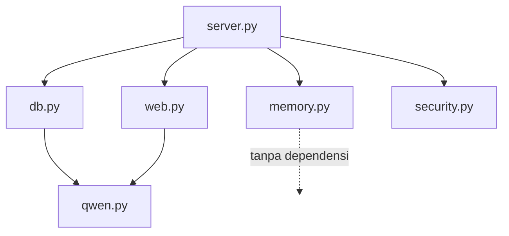
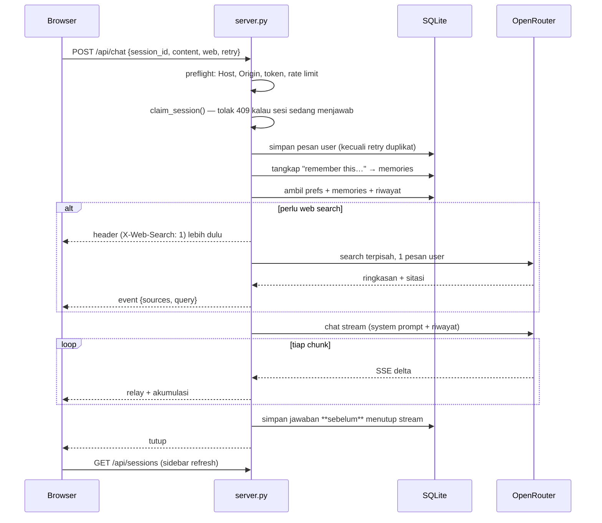

# Arsitektur — MbahGPT

Dokumen ini menjelaskan bagaimana aplikasi ini disusun dan **mengapa** dibuat
begitu. Banyak keputusan di sini lahir dari pengukuran, bukan preferensi; bagian
"kenapa" sengaja ditulis supaya keputusan yang sama tidak perlu diulang dari nol.

> **Dokumen ini bagian dari kode, bukan lampiran.**
> Setiap perubahan atau penambahan pada proyek wajib disertai pembaruan dokumen
> ini dalam perubahan yang sama. Angka apa pun yang ditulis di sini — konstanta,
> batas, harga, ukuran modul — harus dibaca ulang dari kode, bukan dari ingatan
> atau dari versi dokumen sebelumnya. Tabel pemicu dan perintah verifikasinya ada
> di [`CLAUDE.md`](CLAUDE.md). Dokumen yang tidak akurat lebih berbahaya daripada
> tidak ada dokumen.

---

## 1. Ringkasan

**MbahGPT** — chatbox lokal untuk model Qwen lewat OpenRouter. Dua antarmuka
berbagi satu inti: CLI (`qwen.py`) dan web UI (`server.py` + `index.html`).

**Prinsip yang dipegang:**

| Prinsip | Alasan |
|---|---|
| Python stdlib saja, tanpa build step | Jalan di Python 3.9 bawaan macOS. `pip install` dan bundler adalah titik gagal yang tidak perlu untuk alat lokal. |
| API key tidak pernah sampai browser | Halaman bicara ke server lokal; server yang bicara ke OpenRouter. |
| SQLite sebagai sumber kebenaran | Browser hanya mengirim satu pesan baru; konteks dibangun ulang dari database. Reload atau tab kedua tidak pernah kehilangan percakapan. |
| Aman secara default | Bind ke loopback, CSP ketat, dan menolak start kalau diekspos tanpa autentikasi. Dilayani ke internet lewat nginx (§9.2), bukan dengan membuka bind-nya. |

---

## 2. Peta modul

```
qwen.py       205  Inti: .env loader, HTTP request builder, CLI streaming
db.py          306  Skema SQLite + semua akses data
memory.py     120  Ekstraksi "remember this…" + pemeringkatan relevansi
tools.py      193  Eksekusi skrip terbatas + berkas hasil (opt-in)
web.py        177  Deteksi kebutuhan search, ekspansi query, eksekusi search
security.py   214  Kebijakan hardening: CSRF, rebinding, token, CSP, rate limit,
                   daftar putih host publik + kepercayaan pada proxy
server.py      901  HTTP server, routing, orkestrasi satu giliran chat
index.html   2446  UI Ionic + renderer markdown + manajemen stream
fetch-vendor.sh 61 Pengambil aset Ionic (terverifikasi hash)
mbahgpt.service 34 Unit systemd: jalankan server sebagai daemon (§9.1)
install-service.sh 35 Pemasang unit: tulis ulang path, enable, start
nginx-mbahgpt.conf 120 vhost mbahgpt.com: TLS, redirect, proxy SSE (§9.2)
install-site.sh 109 Cek DNS, terbitkan sertifikat, pasang vhost, uji hasilnya

CLAUDE.md      92  Aturan kerja di repo: kewajiban memperbarui dokumen ini,
                   perintah verifikasi angka, batasan yang tidak boleh dilanggar
```

Ketergantungan antarmodul sengaja satu arah:



`memory.py` murni fungsi tanpa I/O — itulah kenapa ia paling mudah diuji.

---

## 3. Alur satu pesan

Ini jalur terpenting di seluruh sistem.



**Generasi lepas dari koneksi.** Balasan diproduksi oleh thread pekerja yang
menulis ke buffer `Generation` di memori; koneksi HTTP hanya *menonton* buffer
itu. Dulu perulangan upstream menulis langsung ke socket browser, sehingga reload
memutus `BrokenPipeError` dan jawaban terpotong di tengah. Sekarang model terus
menulis, dan klien yang menyambung lewat `GET /api/stream/<id>` memutar ulang
buffer dari awal lalu mengikuti sisanya — tidak ada bagian yang hilang.

`/api/sessions` menyertakan `streaming: true` untuk sesi yang masih diproduksi,
dan halaman memakai itu untuk menyambung kembali setelah dimuat. Sesi terakhir
yang dibuka disimpan di `localStorage`, jadi reload mengembalikan pembaca ke chat
yang sama — bukan sekadar melanjutkan diam-diam di latar.

**Kenapa simpan sebelum menutup stream.** Browser me-refresh sidebar begitu
response berakhir. Awalnya penyimpanan terjadi setelah stream ditutup, sehingga
sidebar membaca hitungan pesan yang basi — chat 2 pesan tampil "1 msg". Urutannya
kini dibalik, dan klien membaca stream sampai EOF alih-alih berhenti di `[DONE]`.

---

## 4. Model data

```sql
sessions (id, title, model, created_at, updated_at)
messages (id, session_id→sessions ON DELETE CASCADE, role, content,
          reasoning, sources, created_at)
prefs    (key, value)                       -- response_instructions
memories (id, text, pinned, session_id, created_at)
attachments (id, message_id→messages ON DELETE CASCADE, name, mime, kind, data BLOB)

INDEX  messages_by_session (session_id, id)
INDEX  attachments_by_message (message_id)
UNIQUE memories_unique (lower(text))        -- dedupe case-insensitive
```

Catatan implementasi:

- **Koneksi dibuka per operasi**, bukan dipakai bersama. Server multi-thread dan
  koneksi SQLite tidak aman dilempar antar-thread.
- **WAL mode** supaya pembaca tidak memblokir penulis.
- **`reasoning` dan `sources` disimpan** agar chat lama tetap menampilkan panel
  "Thinking" dan daftar sumbernya.
- **Migrasi additive**: `init()` menjalankan `CREATE TABLE IF NOT EXISTS` lalu
  `migrate()` menambah kolom yang belum ada (`ALTER TABLE`). Database lama ikut
  terbawa tanpa kehilangan data.
- Peran `system` **tidak pernah** disimpan — ia selalu diturunkan dari prefs +
  memories + konteks, jadi mengubah instruksi langsung berlaku ke chat lama.

---

## 5. Subsistem

### 5.1 Streaming

Server merelai SSE dari OpenRouter apa adanya (chunked), sambil mengurai tiap
baris untuk mengumpulkan `content`, `reasoning`, dan `annotations`.

**Model thinking** (default `qwen/qwen3.8-27b`) mengirim `delta.reasoning`
panjang sebelum token jawaban pertama — pernah terukur 2748 karakter reasoning
sebelum 221 karakter jawaban. Tanpa penanganan, UI terlihat menggantung.
Penanganannya: CLI membuang reasoning ke **stderr** (stdout tetap bersih untuk
pipe), UI menampilkannya di panel tertutup dengan penghitung detik berjalan.

### 5.2 Memori & preferensi

- **Penangkapan**: regex mendeteksi `remember…`, `note to self…`, `keep in mind…`,
  `don't forget…`, `for future reference…`. Trigger harus membuka baris (boleh
  setelah klausa pendek berkoma atau kata sopan) — tanpa syarat itu, kalimat
  seperti *"I want to remember this trip"* ikut tersimpan.
- **Pertanyaan ditolak** lewat dua jaring: kata bantu di depan (*"Do you
  remember…"*) dan tanda `?` di akhir.
- **Seleksi**: pinned selalu ikut; sisanya diperingkat berdasarkan irisan kata
  (dengan stemming ringan), dibatasi 12. Ini **leksikal, bukan semantik** —
  "shell" tidak akan menemukan "zsh". Itulah gunanya pin.

### 5.3 Web search

**Keputusan arsitektural terbesar di proyek ini.** Plugin web OpenRouter menempel
hasil pencarian sebagai system message di akhir array. Semua provider yang
melayani `qwen3.8-27b` (Chutes, Io Net, AkashML) menolaknya dengan
`"System message must be at the beginning"` begitu ada system prompt atau riwayat
— artinya search **selalu gagal untuk chat lanjutan**. Pinning provider tidak
menolong; ketiganya menolak.

Solusinya: search dijalankan sebagai **request terpisah berisi satu pesan user**
(bentuk yang didukung), hasilnya disuntikkan sebagai system message di posisi
awal, lalu chat utama berjalan tanpa plugin.

Efek sampingnya menguntungkan: query jadi milik kita, sehingga bisa dibawa
konteks. Follow-up `final ucl` setelah `highlight ucl 2005` dijangkarkan ke pesan
pembuka sesi → `buatkan highlight 2005 final ucl`. Jangkar sengaja memakai **pesan
pembuka saja**, bukan akumulasi semua giliran; akumulasi menghasilkan query
beruntun yang tidak menemukan apa pun.

**Biaya (terukur):** OpenRouter menagih **flat ~$0.007 per pencarian**, berapa pun
jumlah hasilnya.

| | total | inference | biaya search |
|---|---|---|---|
| tanpa search | $0.00192 | $0.00192 | $0 |
| 1 hasil | $0.00792 | $0.00092 | $0.00700 |
| 5 hasil | $0.00842 | $0.00142 | $0.00700 |

Karena itu `max_results` bukan tuas penghematan — yang menentukan biaya adalah
**seberapa sering** search dijalankan. Itulah alasan mode `auto` berbasis kata
kunci ada.

### 5.4 Lampiran

Tiga jenis berkas, tiga jalur berbeda — dipilih berdasarkan yang paling murah dan
paling tepat, bukan yang paling seragam:

| Jenis | Cara sampai ke model | Biaya tambahan |
|---|---|---|
| Gambar (png/jpeg/webp/gif) | bagian `image_url` (data URI) | tarif gambar model |
| PDF | bagian `file` + plugin `file-parser` (`pdf-text`) | **nihil** (terukur) |
| Teks (txt, md, csv, json, kode) | disisipkan langsung ke teks pesan | nihil |

Model default `qwen/qwen3.8-27b` menerima `text`, `image`, dan `video` — dicek
lewat `architecture.input_modalities`, bukan diasumsikan. Model teks-saja seperti
`qwen3-30b-a3b-instruct-2507` akan menolak gambar.

Byte-nya disimpan sebagai BLOB di `chats.db`, bukan di disk, supaya satu berkas
tetap menjadi seluruh cadangan. Endpoint `/api/attachments/<id>` menyajikannya:
gambar `inline`, selain itu dipaksa `attachment` + `application/octet-stream`
supaya berkas tersimpan tidak pernah dieksekusi browser sebagai dokumen.

Lampiran ikut dikirim ulang pada setiap giliran berikutnya di sesi yang sama —
itulah sebabnya pertanyaan lanjutan tentang gambar tetap terjawab, dan juga
sebabnya percakapan panjang dengan banyak gambar jadi mahal.

Batas: `OPENROUTER_MAX_UPLOAD` (default 8 MB total) dan `OPENROUTER_MAX_FILES`
(default 6). Batas 256 KB untuk endpoint lain tetap berlaku — pelonggaran hanya
di jalur chat.

### 5.5 Menjalankan skrip (opt-in)

**Mati secara default.** Togglenya ada di `.env` sebagai `OPENROUTER_TOOLS`
(`0` mati, `1` nyala) — ditulis eksplisit di sana, bukan hanya terdokumentasi,
supaya keputusan menyalakannya terlihat di tempat orang membacanya. Model mendapat dua
tool lewat function calling: `run_script` (python/bash/sh) dan `write_file`.
Berkas apa pun yang tertinggal di direktori kerja disimpan sebagai lampiran pada
jawaban, jadi bisa diunduh lewat endpoint lampiran yang sudah ada.

Yang benar-benar dibatasi:

| Batasan | Nilai |
|---|---|
| Direktori kerja | baru per pesan, dihapus setelah selesai |
| Waktu | `OPENROUTER_TOOL_TIMEOUT` (30 detik) — wall clock **dan** RLIMIT_CPU |
| Memori | `OPENROUTER_TOOL_MEMORY_MB` (512) |
| Ukuran berkas | `OPENROUTER_TOOL_FILE_MB` (16) |
| Proses | RLIMIT_NPROC 64, `setsid` supaya timeout membunuh seluruh grup |
| Lingkungan | dikosongkan — **kunci API tidak ikut** (terverifikasi) |
| Putaran tool | `OPENROUTER_TOOL_ROUNDS` (4) |

**Yang tidak dibatasi, dan ini penting:** skrip tetap berjalan sebagai Anda. Ia
bisa membaca berkas di direktori home dan menjangkau jaringan. Ini membatasi
kecelakaan dan loop liar — bukan penjara.

Risiko paling tajam adalah rantai **hasil web search → system prompt → model →
skrip yang dijalankan**. Halaman yang dibuat khusus bisa berusaha menyetir model
untuk menjalankan sesuatu. Karena itu fiturnya opt-in; jangan nyalakan bersamaan
dengan pencarian web untuk pekerjaan sensitif.

### 5.6 Keamanan

Ancamannya bukan orang asing di internet (server bind ke loopback), melainkan
segala hal lain yang menyentuh mesin ini. **Kecuali** saat `OPENROUTER_PUBLIC_HOST`
diisi: sejak itu orang asing di internet memang bagian dari model ancaman, dan
token menjadi wajib (§9.2).

| Ancaman | Penanganan |
|---|---|
| Halaman web mana pun POST ke `127.0.0.1` (CSRF) | Tolak `Origin` asing → 403 |
| DNS rebinding | Pin header `Host` → 400 |
| Bind `0.0.0.0` tanpa proteksi | **Menolak start** tanpa `OPENROUTER_UI_TOKEN` |
| Dilayani lewat nama domain tanpa proteksi | **Menolak start** kalau `OPENROUTER_PUBLIC_HOST` diisi tanpa token |
| Kunci API terbaca user lain | `.env` dan `chats.db` di-chmod 600 saat start |
| Body raksasa | Batas 256 KB → 413 |
| Boros kredit / abuse | Rate limit 30 chat/menit per IP → 429 |
| XSS dari keluaran model | Renderer hanya membuat DOM node; tidak pernah `innerHTML` |
| Skrip pihak ketiga | CSP `default-src 'none'`, nonce per response |

**CSP dengan Ionic.** Stencil menyuntik `<style>` saat runtime yang normalnya
diblokir kebijakan berbasis nonce. Ionic mengekspor `setNonce`, jadi nonce dari
server diteruskan ke runtime-nya — `unsafe-inline` tetap tidak dipakai.
`script-src` butuh `'self'` karena Ionic memuat chunk-nya lewat `import()`
dinamis.

**Host & Origin di belakang proxy.** `host_allowed()` semula hanya menerima
loopback atau alamat bind, jadi permintaan dengan `Host: mbahgpt.com` ditolak 400
walau proxy-nya benar. Perbaikannya adalah daftar putih eksplisit
(`OPENROUTER_PUBLIC_HOST`), **bukan** menyuruh nginx menimpa `Host` dan `Origin`
dengan `127.0.0.1`. Cara timpa itu memang membuat halaman jalan, tapi sekaligus
mematikan dua penjaga sekaligus: setiap POST lintas situs dari mana pun akan
terlihat sebagai same-origin di mata server.

**X-Forwarded-\* hanya dari loopback.** Header itu ditulis klien dan tidak bisa
dipercaya secara umum; `OPENROUTER_TRUST_PROXY=1` pun hanya berlaku kalau peer
TCP-nya loopback (yaitu nginx di mesin ini). Tanpa itu dua hal rusak diam-diam di
belakang proxy: rate limiter melihat semua orang sebagai `127.0.0.1` sehingga 30
chat/menit menjadi kuota bersama seluruh internet, dan cookie token tidak pernah
ditandai `Secure`.

**Sisa risiko yang diketahui:** hasil web search masuk ke system prompt, jadi
halaman yang di-crawl bisa memuat prompt injection. Tidak ada perbaikan tuntas;
mitigasinya adalah tidak menyalakan search saat membahas hal sensitif.

### 5.7 Konkurensi

Satu jawaban per sesi, beberapa sesi paralel (maksimal 3).

- **Klien**: tiap request punya record sendiri di `Map` per sesi. Berpindah sesi
  hanya melepas ikatan ke layar (`detachViews`), tidak membatalkan request.
  Kembali ke sesi yang masih berjalan akan **menyambung ulang** — teks yang sudah
  masuk dirender ulang dan streaming berlanjut.
- **Server**: `claim_session()` / `release_session()` dengan lock. Mengunci di
  klien saja tidak cukup — tab kedua bisa menembusnya dan dua jawaban akan saling
  menyisip di satu percakapan.

---

## 6. Keputusan UI/UX

### 6.1 Yang ditampilkan saat menunggu

Model thinking bisa diam lama sebelum menjawab (pernah terukur 95 detik). Diam
tanpa kabar terasa seperti hang, tapi menampilkan seluruh isi pikirannya juga
mengganggu. Kompromi: **panel tertutup + penghitung detik berjalan**. Pembaca
tahu sistem hidup, isinya tersedia kalau mau, dan tidak memakan ruang.

Semua `setInterval` dihentikan di setiap jalur keluar (selesai, stop, error,
pindah sesi) supaya tidak ada timer yang menggantung.

### 6.2 Scroll tidak memaksa

Awalnya tiap token memaksa tampilan ke bawah — tidak mungkin membaca ke atas saat
jawaban masih mengalir. Sekarang auto-scroll hanya berlaku bila pembaca memang
sedang di dasar (toleransi 60 px). Menggulir ke atas melepas ikatan; pil
mengambang **"↓ Latest"** mengembalikannya, dengan titik aksen kalau ada teks baru
yang masuk selagi Anda di atas.

Detail teknis: pil itu memakai penetapan `scrollTop` langsung, **bukan**
`scrollTo({behavior:'smooth'})` — smooth scroll diam-diam tidak bekerja di
sebagian konteks browser, dan itu menyembunyikan tombolnya tanpa memindahkan
tampilan.

### 6.3 Penanda sesi

| Penanda | Arti |
|---|---|
| Titik berdenyut | Sesi sedang menjawab di latar |
| Titik diam | Jawaban selesai, belum dibaca |
| Composer terkunci | Sesi ini sedang menjawab — buka/buat chat lain untuk bertanya |

Aksi per sesi (ubah judul, hapus) ada di balik satu tombol **⋮** — deretan ikon
di tiap baris memakan ruang yang dibutuhkan judulnya. Klik ganda pada judul tetap
berfungsi sebagai jalan pintas, dan penyuntingan terjadi di tempat tanpa dialog.

Menunya ditulis sendiri, bukan `ion-popover`: `dismiss()` milik komponen itu
tidak pernah *settle* saat popover dipanggil dari klik biasa, sehingga aksi yang
menunggu di baliknya menggantung selamanya. Menu buatan sendiri juga menutup
lewat klik luar, Escape, dan scroll sidebar.

### 6.4 Pemulihan dari error

Error menyisakan pesan Anda di layar dengan dua tombol: **Coba lagi** dan **Ubah
pesan**. Mengetik ulang prompt panjang hanya karena server sempat restart adalah
gesekan yang tidak perlu.

Retry menandai request sebagai `retry` supaya server memakai ulang pesan yang
sudah tersimpan alih-alih menyimpannya dua kali — "Failed to fetch" bisa berarti
request belum sampai **atau** sudah sampai lalu putus, dan keduanya harus benar.

### 6.5 Rendering markdown

Keluaran model dirender sebagai markdown, tapi selalu lewat pembuatan DOM node —
tidak pernah `innerHTML`. Beberapa keputusan sengaja:

- **`_underscore_` bukan penanda italic.** Itu akan merusak `my_func_name` dan
  `__dunder__`, yang lebih sering muncul di percakapan teknis daripada italic
  bergaris bawah.
- **Autolink pakai daftar TLD terkurasi**, bukan `\.[a-z]+`. Aturan naif membuat
  `Node.js`, `index.html`, dan `config.json` jadi link. TLD yang bentrok dengan
  penulisan kode (`id`, `at`, `in`, `sh`, …) hanya jadi link bila diikuti path.
- **`@handle` butuh konteks platform.** Platform ditentukan per baris dulu, lalu
  se-pesan. Tanpa platform yang disebut, handle dibiarkan teks biasa — menebak
  berisiko mengirim orang ke profil yang salah di platform lain.
- Dekorator kode (`@media`, `@app.route`, `@staticmethod`) masuk denylist.

### 6.6 Menyalin

Dua tombol salin: satu per blok kode (pojok kanan atas blok), satu per jawaban
(di bawah jawaban). Keduanya muncul saat kursor berada di atas elemennya, dan
tetap terlihat di layar sentuh yang tidak punya hover.

Ikon saja, tanpa teks — labelnya pindah ke tooltip dan `aria-label` supaya tombol
tidak bersaing dengan teks yang ditumpanginya. Ikon berganti jadi centang saat
berhasil dan silang saat gagal, lalu kembali setelah 1,6 detik. SVG-nya dibangun
sebagai node, bukan `innerHTML` — aturan yang sama dengan renderer.

Salinan jawaban memakai **sumber markdown**, bukan teks yang sudah dirender —
`textContent` kehilangan `**tebal**`, judul, dan pagar blok kode, sehingga
hasil tempel jadi datar. Sumbernya disimpan pada elemen saat render.

`navigator.clipboard` butuh secure context. `127.0.0.1` memenuhi syarat itu, tapi
server yang sama bisa diakses lewat IP LAN di mana API-nya tidak tersedia — jadi
ada jalur cadangan `execCommand`, dan tombolnya melaporkan kegagalan alih-alih
diam.

### 6.7 Konfigurasi bukan di UI

Model dan temperature dipindah ke `.env`. Keduanya adalah setelan sekali-atur,
bukan keputusan per-pesan; menaruhnya di toolbar hanya menambah kebisingan dan
membuka celah klien menimpa nilainya. Server **mengabaikan**
`model`/`temperature` yang dikirim klien.

Nilainya juga tidak lagi ditampilkan di header. Informasi yang tidak pernah
berubah selama sesi tidak layak menempati ruang permanen — cek lewat
`GET /api/config` atau `.env` kalau perlu. Dengan alasan yang sama, baris di
bawah komposer kini **kosong saat idle** dan hanya terisi saat ada status nyata
("menunggu jawaban", "maksimal 3 chat", pesan kesalahan); tips yang selalu
terpampang berhenti dibaca setelah hari pertama.

Yang tetap di UI adalah toggle **🌐 Web (Auto/On/Off)** — itu keputusan
per-pesan, bukan konfigurasi.

### 6.8 Bahasa visual

Palet: netral hangat (kertas di terang, hitam kecokelatan di gelap) dengan satu
aksen amber. Aksen dipakai hemat — hanya untuk penanda, fokus, dan sesi aktif —
supaya arti "ini penting" tidak luntur.

Keputusan yang membentuk tampilannya:

- **Asimetri pesan.** Pesan Anda rata kanan dalam kartu bernuansa aksen; jawaban
  model mengalir penuh sebagai dokumen dengan titik aksen kecil sebagai penanda.
  Perbedaan bentuk inilah yang membuat transkrip bisa dipindai sekilas, bukan
  label "Anda"/"Qwen".
- **Kedalaman, bukan garis.** Permukaan dibedakan lewat bayangan halus dan
  perbedaan ground, bukan bingkai 1 px di mana-mana. Toolbar memakai latar
  semi-transparan berblur supaya konten terasa mengalir di bawahnya.
- **Monospace untuk metadata.** Label peran, stempel waktu, dan konfigurasi model
  memakai monospace; teks percakapan memakai sans. Ini menautkan tampilan ke
  dunia alat baris perintah tempat proyek ini berasal.
- **Satu bahasa.** Antarmuka seluruhnya bahasa Indonesia. Sebelumnya campur
  Inggris–Indonesia, dan itu terbaca seperti pekerjaan yang belum selesai.

### 6.9 Komposer

Area ketik adalah satu permukaan membulat (radius 26 px) yang memuat semuanya:
teks di atas, toggle web di kiri bawah, tombol kirim bundar di kanan bawah.
Kontrol berada **di dalam** kotak, bukan berjajar di sebelahnya — supaya yang
dominan secara visual adalah tempat mengetik, bukan tombolnya.

- Mengklik bagian mana pun dari kotak menaruh kursor di kolom pesan, bukan hanya
  baris teksnya.
- Tinggi mengikuti isi sampai 176 px, lalu berhenti dan menggulir.
- **Satu tombol, dua peran** (44 px, target sentuh). Saat idle ia tombol kirim
  (`type="submit"`, nonaktif kalau komposer kosong); saat menjawab ia berubah jadi
  tombol berhenti (`type="button"`, warna danger). Dua tombol di posisi yang sama
  berarti salah satunya selalu menganggur.

Jebakan yang menyertainya: `ion-textarea.value` bernilai `undefined` sampai
komponennya terhidrasi. `!input.value.trim()` yang dipanggil di top level melempar
`TypeError`, dan karena itu terjadi saat parsing, **semua listener yang
didaftarkan di bawahnya tidak pernah terpasang** — tombol kirim mati total tanpa
gejala lain. Nilai komposer kini selalu dibaca lewat `composerText()`.

Dua jebakan integrasi Ionic yang ditemukan saat membangun ini — keduanya sunyi,
tidak memunculkan error:

1. **`--border` bukan nama yang aman.** `ion-split-pane` memakai nama custom
   property itu, dan custom property diwariskan — token `--border` kita jadi
   tertimpa untuk seluruh keturunannya, mematikan border di komposer, chip, dan
   daftar sumber sekaligus. Token kita sekarang bernama **`--line`**.
2. **Form control Ionic itu *scoped*, bukan shadow DOM.** `<textarea>` dan
   `<input>` bagian dalamnya ada di light DOM, jadi aturan global
   `textarea, input { … }` ikut mengecatnya. Sekarang aturan itu hanya menyasar
   kontrol native milik aplikasi (`#instructions`, `#memText`, `input.rename`).

Konsekuensi lain: `auto-grow` bawaan `ion-textarea` tidak bekerja setelah kontrol
di dalamnya di-restyle — tingginya diam di satu baris tanpa error. Pertumbuhan
kotak kini dikendalikan langsung dari `growInput()`.

### 6.10 Tanpa title bar

Tidak ada toolbar di atas transkrip — percakapan memakai seluruh kolom. Nama chat
pindah ke **judul tab browser**, tempat yang memang untuk itu dan tidak memakan
ruang layar.

Konsekuensinya harus ditangani: tombol drawer tadinya tinggal di toolbar itu, dan
di ponsel itulah satu-satunya jalan ke daftar sesi. Penggantinya tombol mengambang
di pojok kiri atas transkrip; `ion-menu-button` menyembunyikan dirinya sendiri saat
menu dinonaktifkan — persis kondisi split-pane di desktop — jadi ia hanya muncul
saat memang dibutuhkan.

### 6.11 Mobile

Ionic dipakai untuk kerangka: `ion-split-pane` menjadikan sidebar terpancang di
desktop dan **drawer** di ponsel, plus toolbar yang menghormati safe area.

Yang sengaja **tetap native**: kontainer scroll transkrip (logika follow-to-latest
mengukur `scrollTop`/`scrollHeight` langsung, sedangkan `ion-content`
menyembunyikannya di shadow DOM) dan pil "↓ Latest".

Aset Ionic **tidak disimpan di repo** — `./fetch-vendor.sh` mengambilnya dengan
versi dan hash SHA-512 yang dipatok. Skrip ini mengunduh JavaScript yang akan
dieksekusi di browser, jadi tarball yang tidak cocok ditolak sebelum `vendor/`
lama disentuh.

---

## 7. Konfigurasi

Semua lewat `.env` (lihat `.env.example`). Environment variable asli menang atas
isi file.

| Variabel | Default | Fungsi |
|---|---|---|
| `OPENROUTER_API_KEY` | — | Wajib |
| `OPENROUTER_MODEL` | `qwen/qwen3.8-27b` | Model chat |
| `OPENROUTER_TEMPERATURE` | `0.7` | Sampling |
| `OPENROUTER_UI_TOKEN` | kosong | Wajib untuk bind non-loopback **atau** `PUBLIC_HOST` |
| `OPENROUTER_PUBLIC_HOST` | kosong | Domain yang dilayani lewat proxy, dipisah koma (§9.2) |
| `OPENROUTER_TRUST_PROXY` | `0` | `1` = percayai `X-Forwarded-For/-Proto` dari proxy loopback |
| `OPENROUTER_RATE_LIMIT` | `30` | Chat per menit per klien (0 = mati) |
| `OPENROUTER_MAX_BODY` | `262144` | Batas body request |
| `OPENROUTER_MAX_HISTORY` | `40` | Pesan yang dikirim ulang tiap giliran |
| `OPENROUTER_TIMEOUT` | `120` | Detik menunggu OpenRouter |
| `OPENROUTER_SEARCH_MODEL` | `qwen/qwen3-30b-a3b-instruct-2507` | Perangkum hasil search |
| `OPENROUTER_WEB_RESULTS` | `5` | Hasil per pencarian |
| `OPENROUTER_TOOLS` | `0` | `1` menyalakan eksekusi skrip (lihat §5.5) |
| `OPENROUTER_TOOL_TIMEOUT` | `30` | Detik per skrip |
| `OPENROUTER_TOOL_MEMORY_MB` | `512` | Batas memori skrip |
| `OPENROUTER_TOOL_ROUNDS` | `4` | Putaran tool per jawaban |
| `OPENROUTER_MAX_UPLOAD` | `8388608` | Total byte lampiran per pesan |
| `OPENROUTER_MAX_FILES` | `6` | Jumlah berkas per pesan |
| `OPENROUTER_DB` | `chats.db` | Lokasi database |

`MAX_HISTORY` memotong dari tengah dan **selalu mempertahankan pesan pembuka** —
pesan itu yang menjangkarkan follow-up pendek.

---

## 8. Batasan yang diketahui

1. **Prompt injection lewat hasil search** (§5.4) — tidak ada perbaikan tuntas.
2. **Pemeringkatan memori leksikal**, bukan semantik (§5.2). Pin untuk fakta yang
   harus selalu berlaku.
3. **Link dibuat dari pola teks, bukan verifikasi.** Kalau model mengarang
   username, link tetap terbentuk dan mengarah ke halaman kosong.
4. ~~**HTTP polos.**~~ **Teratasi untuk mbahgpt.com** (§9.2): nginx memegang TLS
   Let's Encrypt, HTTP dialihkan ke HTTPS, dan HSTS aktif. Yang tetap berlaku:
   server Python sendiri hanya bicara HTTP polos di loopback, jadi paparan lewat
   nama domain lain **harus** melalui proxy yang sama — bind langsung ke
   `0.0.0.0` mengirim token sebagai teks biasa.
5. **URL berkurung** seperti `en.wikipedia.org/wiki/Foo_(bar)` terpotong di kurung
   buka.
6. **Riwayat dipotong di 40 pesan** — percakapan sangat panjang kehilangan bagian
   tengahnya.

---

## 9. Menjalankan

```bash
./fetch-vendor.sh        # sekali, memasang aset UI
./server.py              # buka http://127.0.0.1:8000

./qwen.py "pertanyaan"   # CLI, streaming
./qwen.py --list         # daftar model Qwen yang tersedia
```

Bind non-loopback butuh token:

```bash
OPENROUTER_UI_TOKEN=$(python3 -c "import secrets;print(secrets.token_urlsafe(32))") \
  ./server.py --host 0.0.0.0
```

### 9.1 Sebagai daemon (systemd)

```bash
./install-service.sh              # pasang unit, enable, start
./install-service.sh --uninstall  # lepas kembali

systemctl status mbahgpt.service
journalctl -u mbahgpt.service -f  # log server: stdout/stderr masuk journald
```

`install-service.sh` menyalin `mbahgpt.service` ke `/etc/systemd/system/` sambil
menulis ulang path repo, `User=`, dan `Group=` sesuai tempat pemasangan — jadi
berkas unit di repo tidak perlu diedit saat repo dipindah. Ia juga menjalankan
`./fetch-vendor.sh` kalau `vendor/ionic` belum ada; tanpa itu layanan hidup tapi
halamannya tidak merender.

Keputusan yang perlu diingat:

- **Kredensial tetap dari `.env`, bukan dari unit.** Tidak ada `EnvironmentFile=`
  ke `.env`: kunci API sudah dibaca `qwen.load_env` dari `WorkingDirectory`, dan
  menyalinnya ke `/etc` hanya menggandakan rahasia ke berkas yang dapat dibaca
  lebih luas. `security.protect_file` tetap mengetatkan `.env` dan `chats.db` ke
  0600 saat start — terlihat di journal sebagai baris `note: tightened permissions`.
- **`PYTHONUNBUFFERED=1`.** Tanpa ini stderr Python dibuffer karena journald
  bukan TTY, dan baris `serving on …` baru muncul jauh belakangan.
- **`ProtectHome` sengaja tidak dipakai.** Repo, `.env`, dan `chats.db` ada di
  `/home`, jadi menyembunyikan `/home` mematikan layanan. Hardening lain
  (`NoNewPrivileges`, `PrivateTmp`, `ProtectSystem=full`, `ProtectKernel*`,
  `RestrictSUIDSGID`, `LockPersonality`) tetap aktif.
- **`Restart=on-failure` + `RestartSec=3`.** Proses mati (mis. OOM kill) hidup
  lagi dalam ~3 detik. Salah konfigurasi tidak berputar selamanya:
  `security.startup_check` keluar dengan kode 1 saat bind non-loopback tanpa
  token (§5.6), dan setelah 5 percobaan dalam 10 detik (default
  `StartLimitBurst`) unit berhenti di status `failed` — alasannya terbaca di
  `journalctl`, bukan tenggelam dalam restart tak berujung.
- **Bind default `--host 127.0.0.1 --port 8000`.** Mengubahnya ke alamat non-
  loopback butuh `OPENROUTER_UI_TOKEN` di `.env`, kalau tidak unit gagal start.

### 9.2 Di balik domain (nginx + Let's Encrypt)

`mbahgpt.com` dilayani nginx di mesin ini, yang mem-proxy ke `127.0.0.1:8000`.
Server Python **tetap** bind loopback: satu-satunya pintu dari internet adalah
nginx, dan itu yang memegang TLS.

```bash
./install-site.sh --email you@example.com   # sertifikat + vhost + verifikasi
./install-site.sh --uninstall               # lepas vhost, sertifikat dibiarkan
```

Prasyarat di sisi DNS — record A ke IP publik mesin ini (Namecheap: Domain List →
Manage → Advanced DNS):

```
A    @      <ip publik>
A    www    <ip publik>
```

`install-site.sh` memeriksa itu lebih dulu dan berhenti dengan instruksi kalau
belum menyebar; tanpa pemeriksaan itu, kegagalan muncul jauh di dalam certbot
sebagai error yang tidak menjelaskan apa-apa (yang menjawab tantangan ACME adalah
server lain — halaman parkir registrar).

Tiga berkas nginx di level `http` sudah ada sebelumnya dan dipakai apa adanya:
`conf.d/10-hardening.conf` (timeout slowloris, zona `limit_req`, peta `$block_ua`
dan `$bad_path`, format log `antibot`), `conf.d/20-vhost.conf` (peta
`$connection_upgrade`, pengecualian ACME), dan `sites-enabled/000-catch-all`
(Host tak dikenal → 444).

Keputusan yang perlu diingat:

- **Urutan: sertifikat dulu, vhost kemudian.** `nginx-mbahgpt.conf` menunjuk ke
  `/etc/letsencrypt/live/mbahgpt.com/`, dan nginx menolak start kalau berkas itu
  belum ada. Sertifikat pertama diterbitkan mode `certonly --webroot` lewat
  webroot ACME milik catch-all — jalur yang sengaja dibiarkan hidup di
  `20-vhost.conf` justru untuk kasus ini.
- **`certonly`, bukan installer nginx.** Kalau certbot mengedit sendiri berkas
  vhost, salinan di repo dan yang terpasang di `/etc` akan pelan-pelan berbeda.
  Konsekuensinya: parameter TLS ditulis eksplisit di vhost, karena berkas
  `options-ssl-nginx.conf` milik plugin itu tidak dijamin ada.
- **`proxy_buffering off`.** Ini bukan penyetelan performa, tapi syarat agar
  streaming tetap streaming. Dengan buffering default nginx menahan potongan SSE
  sampai buffernya penuh: halaman diam beberapa detik lalu seluruh jawaban muncul
  sekaligus. `gzip off` untuk alasan yang sama.
- **`proxy_read_timeout 600s`.** Harus lebih longgar dari `OPENROUTER_TIMEOUT`
  (120 s) ditambah pencarian web dan putaran tool, kalau tidak nginx memutus
  stream yang sebenarnya masih hidup.
- **`Host` dan `Origin` diteruskan asli**, dan server menerimanya karena ada di
  `OPENROUTER_PUBLIC_HOST` — alasannya di §5.6.
- **`www` → apex, bukan dua situs.** Token disimpan sebagai cookie per host, jadi
  dua nama berarti dua sesi login yang membingungkan.
- **Tanpa OCSP stapling.** Sertifikat Let's Encrypt sudah tidak memuat URL OCSP
  responder, jadi `ssl_stapling on` hanya menghasilkan peringatan di log setiap
  kali nginx dimuat ulang, tanpa manfaat.
- **HSTS tanpa `includeSubDomains`.** Subdomain lain `mbahgpt.com` belum tentu
  ber-TLS; HSTS yang terlalu lebar mematikannya tanpa jalan mundur cepat.
- **Hook reload setelah perpanjangan.** `certbot.timer` hanya menulis berkas baru;
  nginx masih memegang sertifikat lama di memori. `renewal-hooks/deploy/reload-nginx.sh`
  yang menutup celah itu.
- **`curl` dari luar dijawab 444, bukan 200.** `$block_ua` di `10-hardening.conf`
  menolak library HTTP mentah dari IP tak tepercaya; lewat HTTP/2 itu terlihat
  sebagai `PROTOCOL_ERROR` di sisi curl. Uji dari luar butuh `-A` user-agent
  browser — dari loopback tidak, karena loopback termasuk `$trusted_ip`.

### 9.3 Perpanjangan TLS otomatis

Tidak ada cron atau skrip sendiri: yang dipakai adalah `certbot.timer` bawaan
paket Debian/Ubuntu, ditambah satu deploy hook. Angka-angka di bawah dibaca dari
unit dan berkas renewal di mesin ini, bukan dari ingatan.

| Bagian | Nilai | Sumber |
|---|---|---|
| Jadwal | `OnCalendar=*-*-* 00,12:00:00`, `RandomizedDelaySec=43200`, `Persistent=true` | `certbot.timer` |
| Perintah | `certbot -q renew --no-random-sleep-on-renew` | `certbot.service` |
| Ambang perpanjangan | 30 hari sebelum kedaluwarsa | `renewal/mbahgpt.com.conf` |
| Metode | `authenticator = webroot`, `/var/www/letsencrypt` untuk apex dan `www` | `renewal/mbahgpt.com.conf` |
| Setelah berhasil | `renewal-hooks/deploy/reload-nginx.sh` → `systemctl reload nginx` | hook |

Dua hal yang membuat rantai ini mudah patah tanpa terasa:

1. **Blok ACME harus di atas redirect 301.** Tantangan ACME datang lewat http
   polos ke nama domainnya. Setelah vhost `mbahgpt.com` ada, permintaan itu tidak
   lagi jatuh ke catch-all, jadi `location ^~ /.well-known/acme-challenge/` di
   blok port 80 vhost inilah yang menjawabnya. Kalau urutannya tertukar, yang
   diterima Let's Encrypt adalah 301 dan perpanjangan gagal — 60 hari setelah
   penerbitan, saat tidak ada yang sedang memperhatikan.
2. **`--dry-run` tidak menjalankan deploy hook** (certbot mencatatnya sebagai
   "Dry run: skipping deploy hook command"). Jadi dry-run yang sukses **bukan**
   bukti nginx akan memuat sertifikat baru; hook-nya harus diuji terpisah.

Cara memverifikasi keduanya:

```bash
# 1. Jalur ACME lewat vhost sungguhan — harus 200 dan isinya "ok", bukan 301.
echo ok | sudo tee /var/www/letsencrypt/.well-known/acme-challenge/probe >/dev/null
curl -sS -A "Mozilla/5.0" http://mbahgpt.com/.well-known/acme-challenge/probe
sudo rm /var/www/letsencrypt/.well-known/acme-challenge/probe

# 2. Simulasi perpanjangan penuh (butuh ~1-4 menit, memakai server staging).
sudo certbot renew --dry-run

# 3. Hook-nya sendiri: worker nginx harus berganti PID dan situs tetap hidup.
sudo /etc/letsencrypt/renewal-hooks/deploy/reload-nginx.sh

# Kapan sertifikat sekarang habis, dan kapan timer berikutnya jalan:
sudo certbot certificates | grep -A1 mbahgpt.com
systemctl list-timers certbot.timer
```

**Kalau perpanjangan gagal**, sinyalnya ada di dua tempat: `journalctl -u
certbot.service` di mesin ini, dan email peringatan kedaluwarsa dari Let's Encrypt
ke alamat yang didaftarkan saat penerbitan pertama. Tidak ada pemantauan aktif
untuk itu di repo ini — jendelanya 30 hari, jadi kegagalan sekali dua kali masih
punya banyak ruang untuk diperbaiki.
